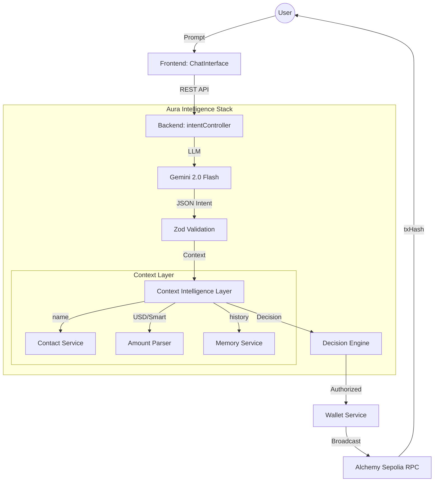

# 🏛️ Research-Grade Autonomous Web3 Prototype V2.2 — Architecture Design

This document details the architecture of the Aura Autonomous Agent (Research-Grade Prototype). The system is a proof-of-concept designed to transition Web3 interaction from **technical commands** to **human-native conversation**.

## 1. System Overview

Research-Grade Autonomous Web3 Prototype introduces a multi-layered intelligence stack that sits between the User (Natural Language) and the Blockchain (Execution).

## 2. Core Components

### 🧠 Research-Grade Autonomous Web3 Prototype — The Context Intelligence Layer
The most significant upgrade in Research-Grade Autonomous Web3 Prototype. It resolves human ambiguity before execution:
- **Contact Service:** Maps simple names (e.g., "John") to 0x addresses using a local persistent store.
- **Amount Parser:** Uses **CoinGecko API** to perform real-time USD-to-Token conversions.
- **Memory Service:** Implements "Transaction Context Recall," allowing users to repeat previous actions ("Same as last time").

### ⚡ Fast-Broadcast Execution Model
To solve Web3 latency, V2.1 uses a non-blocking broadcast pattern:
1. The backend signs and sends the transaction to the mempool.
2. The `txHash` is returned to the UI immediately (~2 seconds).
3. Block confirmation is tracked in the background.

### 🛡️ Decision Engine (The 'Unbreakable' Guard)
New in V2.2, a deterministic middleware that performs pre-execution validation:
- **Thresholds:** Blocks anything > 0.1 ETH.
- **Liquidity:** Ensures 20% gas reserve in bot wallet.
- **Scoring:** Assigns a 0-100% Safety Score based on risk flags.

### 🧠 Neural Interface (Frontend Wow Factor)
The UI now reflects the AI's compute lifecycle:
- **Neural Stages:** `Analyzing` -> `Resolving` -> `Verifying` -> `Executing`.
- **Insight Badges:** Displays `Safety Score` and `Price Source` directly in chat.
- **NeuralStatus Dashboard:** Fixed overlay showing system health.

### 🔐 Multi-Factor Safety Guard

## 3. Persistent Storage (Edge-Persistence)
Aura uses a lightweight JSON-based persistent store (`aura_db.json`) for demo portability. 
- **Schema-ready:** Designed for full Prisma/PostgreSQL migration.
- **Encrypted Local Storage:** Ensures user data stays within the local environment.

## 4. Verifiable Execution Model
Aura maintains an off-chain **Audit Log** that maps every `txHash` to the user's original natural language prompt. This ensures transparency and verifiability of the AI's autonomous decisions.
